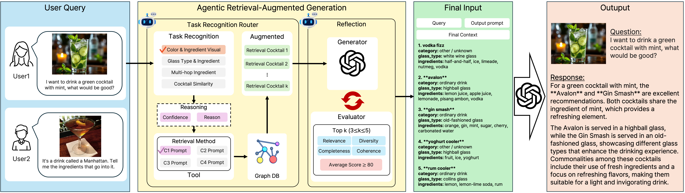
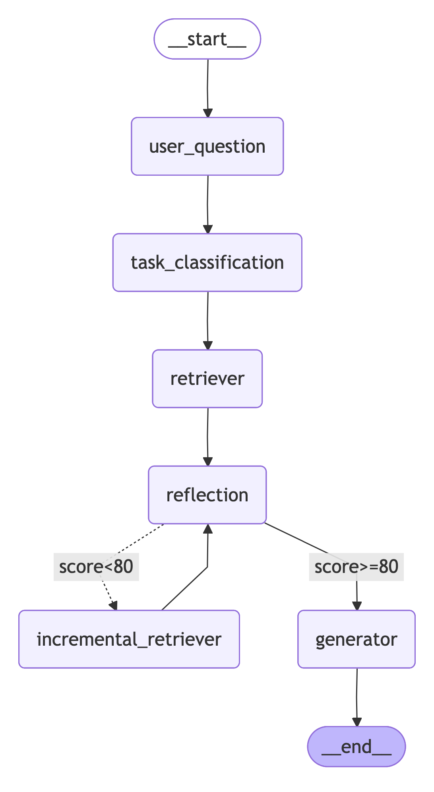
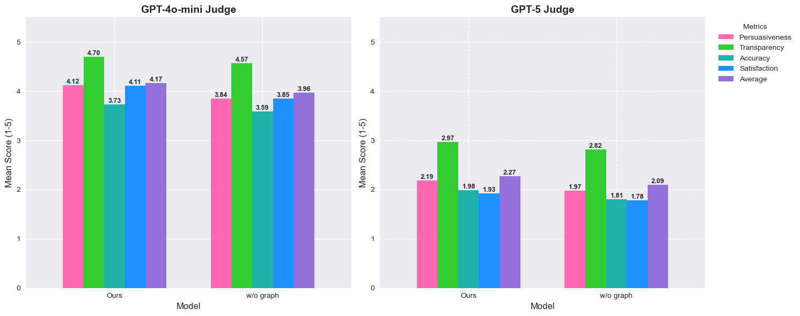

# Cocktail Recommendation Agent RAG

Multi-Agent RAG system for cocktail recommendations.




### Key Features

- **Task Classification**: Support for various cocktail recommendation scenarios
  - C1: Color-Ingredient Visual Search
  - C2: Glass Type with Ingredient Matching
  - C3: Multi-hop Ingredient Expansion
  - C4: Cocktail Similarity and Recipe-Alternative
- **Image Description**: Cocktail recommendations through image description
- **Quality Evaluation**: Answer quality management through Reflection
- **Reflection (Incremental Search)**: Additional search when quality is low


## System Architecture



The system operates through the following steps:

1. **user_question**: User input processing and preprocessing
2. **task_classification**: Classify question type into C1-C4 categories
3. **retriever**: Cocktail search based on classified task
4. **reflection**: Quality evaluation of search results (score-based)
5. **Conditional branching**:
   - **score < 80**: Additional search via `incremental_retriever` and re-evaluation
   - **score >= 80**: Final answer generation via `generator`

## Usage


## Environment Setup

```bash
# Required environment variables (.env file)
NEO4J_URI=neo4j://localhost:7687
NEO4J_USER=neo4j
NEO4J_PASSWORD=your_password
OPENAI_API_KEY=your_openai_api_key
```

## Getting Started

1. Set environment variables
2. Run Neo4j database
3. Execute `user.ipynb`
4. Input your cocktail questions

### Running Jupyter Notebook

Use `user.ipynb` to test the system:

```python
# 1. Initialize RAG system
rag = RAG()

# 2. Text query
rag.query = "Please recommend a cocktail with refreshing mint"
result = rag.run()

# 3. Image + text combined query
rag.query = "Please recommend another cocktail using similar ingredients to this one"
rag.image_path = "image/mojito.jpeg"
result = rag.run()

# 4. Visualize results
display_comparison_results(result, rag.query, rag.image_path)
```

## Experimental Results

We evaluated our Multi-Agent RAG for Cocktails (MARC) system against a baseline approach (MARC w/o Graph). All cocktail recommendations were generated using GPT-4o-mini.

### Evaluation Setup
- **Response Generation**: GPT-4o-mini
- **Evaluation Methods**: 
  - LLM-as-a-Judge (GPT-4o-mini, GPT-5) on 187 test questions
  - Human evaluation on a sampled subset of 77 questions
- **Metrics**: Persuasiveness, Transparency, Accuracy, Satisfaction (1-5 Likert scale)

### Results Overview


### Detailed Performance Comparison

<sub>

| Evaluator | System | Pers. | Trans. | Acc. | Satis. | Avg. |
|-----------|--------|-------|--------|------|--------|------|
| GPT-4o-mini | Baseline | 3.84 | 4.57 | 3.59 | 3.85 | 3.96 |
| | **MARC** | **4.12** | **4.70** | **3.73** | **4.11** | **4.17** |
| GPT-5 | Baseline | 1.97 | 2.82 | 1.81 | 1.78 | 2.09 |
| | **MARC** | **2.19** | **2.97** | **1.98** | **1.93** | **2.27** |
| Human | Baseline | 4.27 | 4.41 | 4.31 | 4.12 | 4.28 |
| | **MARC** | 4.25 | **4.44** | **4.38** | 4.14 | **4.30** |

</sub>

*Pers. = Persuasiveness, Trans. = Transparency, Acc. = Accuracy, Satis. = Satisfaction, Avg. = Average*

*Baseline = MARC w/o Graph*

Our MARC system consistently outperformed the baseline across most metrics, demonstrating the effectiveness of our graph-based approach for cocktail recommendations.
